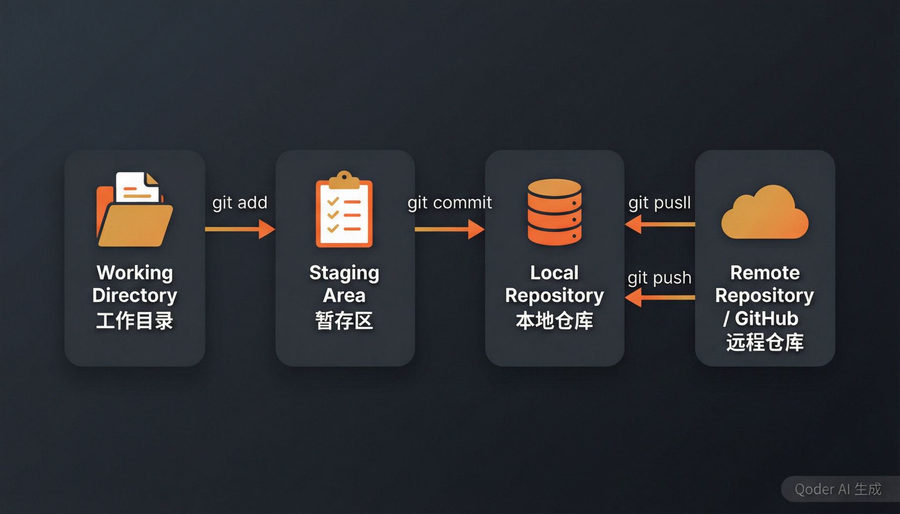
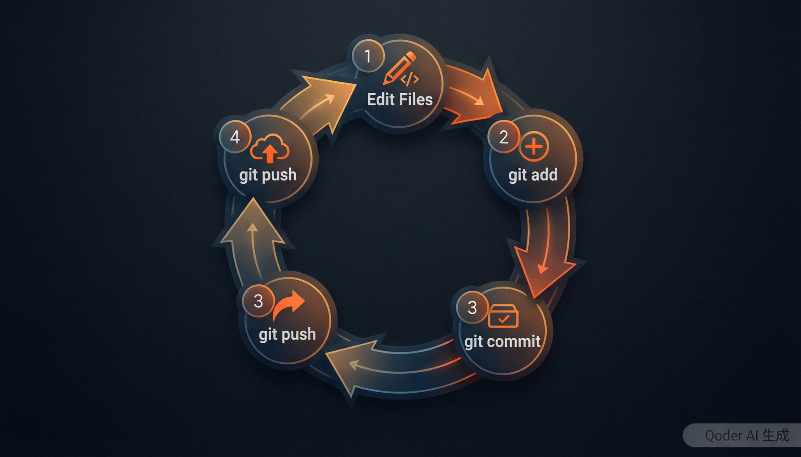
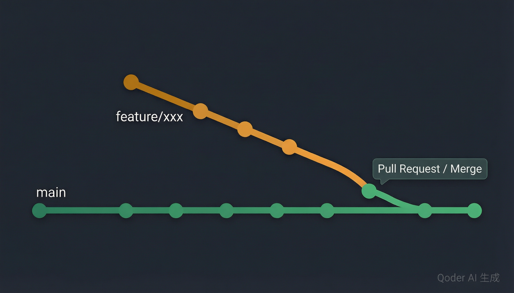

<div align="center">

# 📘 Git 入门完整教程

**从零开始，到日常熟练使用**

`零基础` `全流程` `实操导向` `含速查表`

> 读完即可独立完成 **「克隆 → 修改 → 提交 → 推送」** 完整工作流。

</div>

---

## 📑 目录

| | 章节 | 内容概要 |
|:---:|------|----------|
| 01 | [🔧 安装与配置](#1-安装与配置一次性) | 下载 Git、配置身份、SSH 密钥 |
| 02 | [🧠 核心概念速览](#2-核心概念速览) | 工作区、暂存区、仓库的关系 |
| 03 | [🚀 两种起手方式](#3-两种起手方式) | clone 还是 init？ |
| 04 | [📥 从 GitHub 克隆项目](#4-从-github-克隆项目) | 下载别人项目的方法 |
| 05 | [📤 本地项目推送到 GitHub](#5-本地项目推送到-github) | 把自己的项目传上去 |
| 06 | [🔁 日常三板斧](#6-日常三板斧改--提交--推送) | add → commit → push 循环 |
| 07 | [📡 拉取远程更新](#7-拉取远程更新) | pull、冲突解决 |
| 08 | [🌿 分支管理](#8-分支管理) | 分支创建、合并、PR |
| 09 | [⏪ 撤销与回滚](#9-撤销与回滚) | 后悔药大全 |
| 10 | [💡 实用技巧](#10-实用技巧) | .gitignore、stash、别名等 |
| 11 | [🔍 常见问题排查](#11-常见问题排查) | 报错解决指南 |
| 12 | [📋 速查表](#12-速查表) | 命令速查，随用随翻 |

---

## 1. 🔧 安装与配置（一次性）

### 下载安装

- **Windows**：[https://git-scm.com/](https://git-scm.com/) 下载安装包，一路默认即可
- **Mac**：自带，或在终端运行 `brew install git`
- **Linux**：`sudo apt install git`（Debian/Ubuntu）或 `sudo yum install git`（CentOS）

安装完成后打开终端（Windows 用 Git Bash 或 PowerShell），输入：

```bash
git --version
```

看到版本号说明装好了。

### 必做：配置身份

每次提交都会记录作者信息，**必须配置**：

```bash
git config --global user.name "你的名字"
git config --global user.email "你的邮箱@example.com"
```

> 📌 **建议**：邮箱用 GitHub 注册邮箱，这样 GitHub 网页上能正确显示你的贡献。

### 验证配置

```bash
git config --list
```

### 推荐：配置默认分支名

```bash
git config --global init.defaultBranch main
```

### 可选：配置 SSH 密钥（免密码推送）

HTTPS 方式每次推送要输 token，配置 SSH 后免输：

```bash
# 1. 生成密钥（一路回车即可）
ssh-keygen -t ed25519 -C "你的邮箱@example.com"

# 2. 复制公钥内容
# Windows:
cat ~/.ssh/id_ed25519.pub | clip
# Mac:
cat ~/.ssh/id_ed25519.pub | pbcopy
# Linux:
cat ~/.ssh/id_ed25519.pub

# 3. 粘贴到 GitHub
#    GitHub → Settings → SSH and GPG keys → New SSH key → 粘贴保存

# 4. 测试
ssh -T git@github.com
# 看到 "Hi xxx! You've successfully authenticated..." 即可
```

之后克隆仓库用 `git@github.com:xxx/xxx.git` 形式。

---

## 2. 🧠 核心概念速览

理解这三个区域是学 Git 的关键：



```
┌─────────────┐    git add     ┌─────────────┐   git commit   ┌─────────────┐   git push   ┌─────────────┐
│   工作区     │  ─────────→  │   暂存区     │  ──────────→  │   本地仓库   │  ─────────→  │   远程仓库   │
│ Working Dir  │              │   Stage      │              │  Repository  │              │  GitHub     │
└─────────────┘               └─────────────┘               └─────────────┘              └─────────────┘
       ↑                                                                       │
       └─────────────────────────── git pull ──────────────────────────────────┘
```

| 概念 | 解释 |
|------|------|
| **工作区** | 你在电脑上看到的文件，编辑修改都在这里发生 |
| **暂存区** | 临时存放"准备提交"的修改，相当于一个购物车 |
| **本地仓库** | 你的电脑上的 `.git` 目录，存了所有历史版本 |
| **远程仓库** | GitHub、Gitee 等服务器上的仓库，团队共享的地方 |

> 💡 **为什么需要暂存区？** 让你能精确控制"哪些改动一起提交"。比如改了 3 个文件，但你只想提交其中 2 个，就只 `add` 那 2 个。

---

## 3. 🚀 两种起手方式

> 根据你的场景选择起点：

| | 方式 A：`git clone` | 方式 B：`git init` |
|:---:|---|---|
| **场景** | 远程**已有**仓库 | 本地**已有**项目 |
| **典型情况** | 想下载/参与别人的项目 | 想把自己的项目推到 GitHub |
| **第一步** | `git clone <url>` | `git init` |
| **方向** | 远程 → 本地 | 本地 → 远程 |

---

## 4. 📥 从 GitHub 克隆项目

**场景**：看到 `https://github.com/xxx/some-project` 想用。

### 基本克隆

```bash
# 进入想放项目的目录
cd D:\code        # Windows
cd ~/code         # Mac/Linux

# 克隆
git clone https://github.com/xxx/some-project.git

# 进入项目目录
cd some-project
```

克隆完成后，你会得到：
- 所有文件
- 隐藏的 `.git` 目录（这是 Git 的"大脑"，所有历史都在这里，**不要删**）

### 常用查看命令

```bash
git status          # 看哪些文件被修改了
git log --oneline   # 看提交历史（每条一行显示）
git log             # 看详细历史
git remote -v       # 看远程仓库地址
```

### 克隆特定分支

```bash
git clone -b dev https://github.com/xxx/some-project.git
```

### 浅克隆（只下载最近几个提交，省时间）

```bash
git clone --depth 1 https://github.com/xxx/some-project.git
```

---

## 5. 📤 本地项目推送到 GitHub

**场景**：本地 `D:\my-project` 文件夹有一堆文件，要传到 GitHub 新建的 `my-project` 仓库。

### 第 1 步：在 GitHub 创建仓库

1. 登录 GitHub → 右上角 **+** → **New repository**
2. 填写仓库名（如 `my-project`）
3. **不要勾选** "Initialize with README"（避免冲突）
4. 点击 **Create repository**

### 第 2 步：本地推送

```bash
cd D:\my-project

# 1. 初始化成 Git 仓库（产生 .git 目录）
git init

# 2. 把所有文件加进暂存区
git add .

# 3. 第一次提交
git commit -m "初始化：上传第一版"

# 4. 关联远程仓库
git remote add origin https://github.com/你的用户名/my-project.git

# 5. 推送到远程
git push -u origin main
```

### 第一次推送会要密码

GitHub 已**不支持直接用密码推送**，必须用 **Personal Access Token (PAT)** 当密码。

**生成 Token**：
1. GitHub → 右上角头像 → **Settings**
2. 左侧最底 **Developer settings**
3. **Personal access tokens** → **Tokens (classic)** → **Generate new token**
4. 勾选 `repo` 权限（必需）
5. 点 **Generate token**
6. **立即复制**那串 token（只显示一次！）

推送时弹窗里：
- Username：你的 GitHub 用户名
- Password：**粘贴那串 token**（不是 GitHub 密码）

---

## 6. 🔁 日常三板斧：改 → 提交 → 推送

这是 Git 用得最多的循环，**一定要背下来**：



```bash
git add <文件>      # 把修改放进暂存区
git commit -m "说明"  # 提交到本地仓库
git push            # 推送到 GitHub
```

### 完整示例

**场景**：加了 3 个 mod 进去，提交并推送：

```bash
# 改了文件后，先看状态
git status
# 输出类似：
#   modified:   mods.txt
#   modified:   README.md

# 把所有修改加进暂存区（. 表示当前目录所有变化）
git add .

# 提交
git commit -m "新增 3 个性能优化 mod"

# 推送到 GitHub
git push
```

### 只提交某个文件

```bash
git add README.md
git commit -m "更新说明文档"
git push
```

### 提交信息怎么写

好的提交信息让别人（和未来的你）一眼看懂：

✅ **好的示例**：
```bash
git commit -m "修复登录按钮在 Firefox 下点击无效的 bug"
git commit -m "新增用户头像上传功能"
git commit -m "更新 README，补充安装步骤"
```

❌ **不好的示例**：
```bash
git commit -m "update"
git commit -m "fix"
git commit -m "乱七八糟"
```

> 📌 **规范建议**：可以参考约定式提交（Conventional Commits）`feat:` `fix:` `docs:` `style:` `refactor:` 等前缀。

### 提交前撤销 `git add`

```bash
git restore --staged <文件>   # 把文件从暂存区撤回来，但保留工作区的修改
```

---

## 7. 📡 拉取远程更新

别人（或者你在另一台电脑）推了新内容，你想同步到本地：

```bash
git pull
```

这等于 `git fetch`（抓取）+ `git merge`（合并）两步合一。

### 强制拉取（**危险！会丢弃本地未提交的修改**）

```bash
git fetch origin
git reset --hard origin/main
```

### 遇到冲突怎么办

两个人改了同一行，`git pull` 会报 `CONFLICT`：

```
Auto-merging readme.md
CONFLICT (content): Merge conflict in readme.md
Automatic merge failed; fix conflicts and then commit the result.
```

打开冲突文件，你会看到冲突标记：

```markdown
<<<<<<< HEAD
你写的内容
=======
对方写的内容
>>>>>>> origin/main
```

**手动解决**：
1. 编辑文件，删掉 `<<<<<<<`、`=======`、`>>>>>>>` 这三行标记
2. 保留正确的内容
3. 重新 `add` + `commit` + `push`：

```bash
git add readme.md
git commit -m "解决冲突"
git push
```

---

## 8. 🌿 分支管理

### 为什么用分支

主分支（`main`）是稳定版。你想试个新功能又怕搞坏主分支，就**开一条新分支**去试，稳了再合回来。



### 核心命令

```bash
# 创建并切换到新分支
git checkout -b feature/add-new-feature

# 在新分支上正常 add / commit
git add .
git commit -m "在新分支上开发新功能"

# 首次推送新分支到远程（要加 -u）
git push -u origin feature/add-new-feature
```

### 在 GitHub 上创建 Pull Request（合并请求）

1. 推送新分支后，GitHub 通常会弹提示
2. 点 **Compare & pull request** → 写标题和说明
3. 点 **Create pull request**
4. 审核通过后点 **Merge pull request** 合并到 main

### 切回主分支

```bash
git checkout main
```

### 合并分支到主分支

```bash
git checkout main
git merge feature/add-new-feature
```

### 删除分支

```bash
# 删本地分支
git branch -d feature/add-new-feature

# 删远程分支
git push origin --delete feature/add-new-feature
```

### 列出所有分支

```bash
git branch          # 本地
git branch -a       # 本地 + 远程
```

### 重命名分支

```bash
git branch -m old-name new-name
```

---

## 9. ⏪ 撤销与回滚

⚠️ **警告**：下面的 `reset --hard` 和 `checkout --` 会**丢弃未提交的修改**，用之前确保你不需要那些改动。

### 撤销工作区的修改

文件回到上次提交状态（**未保存的改动会丢**）：

```bash
git checkout -- <文件>
# 或新写法：
git restore <文件>
```

### 把文件从暂存区撤回来

```bash
git restore --staged <文件>
```

### 修改最近一次 commit 的说明

```bash
git commit --amend -m "新的说明"
```

### 回退到某个旧版本（**安全**，生成新提交）

```bash
git revert <提交哈希>
```

### 回退到某个旧版本（**危险**，改写历史）

**只对未推送的提交用**：

```bash
git reset --hard <提交哈希>
```

### 查看所有操作记录（包括已删除的）

```bash
git reflog
```

这是 Git 的"后悔药终极武器"——`reset --hard` 后还能用 `reflog` 找回来。

### 撤销已经推送到远程的提交

```bash
# 1. 本地回退
git reset --hard HEAD~1

# 2. 强制推送到远程
git push --force
```

> ⚠️ **警告**：force push 会**覆盖远程历史**，如果是多人协作的分支会坑到队友。除非明确知道后果，否则不要用。

---

## 10. 💡 实用技巧

### 10.1 `.gitignore`：让某些文件不进入 Git

在项目根目录新建 `.gitignore`，一行一个规则：

```gitignore
# 编译产物
*.log
*.tmp
build/
dist/
*.exe

# 依赖目录
node_modules/
vendor/

# IDE 配置
.idea/
.vscode/
*.swp

# 系统文件
.DS_Store
Thumbs.db

# 敏感信息（千万别提交！）
*.env
config/local.json
```

> 💡 **技巧**：用 [gitignore.io](https://www.toptal.com/developers/gitignore) 自动生成常用语言的 `.gitignore` 模板。

### 10.2 `git stash`：临时藏起来

改到一半要切分支又不想提交：

```bash
git stash           # 把当前修改藏起来
git checkout main   # 切到别的分支
# ... 处理完回来
git checkout your-branch
git stash pop       # 恢复刚才藏的修改
```

### 10.3 看某行是谁写的

```bash
git blame <文件>
```

### 10.4 图形化查看历史

```bash
git log --oneline --graph --all
```

输出类似：

```
*   a1b2c3d 合并 PR #5
|\
| * d4e5f6 修复登录 bug
* | 7g8h9i 更新文档
|/
* 0j1k2l 初始提交
```

### 10.5 改写最近一次提交（追加修改）

```bash
git add 忘加的文件
git commit --amend --no-edit   # 不改说明，把改动合并进最近一次提交
```

### 10.6 给命令起别名

```bash
git config --global alias.st status      # git st = git status
git config --global alias.co checkout    # git co = git checkout
git config --global alias.br branch      # git br = git branch
git config --global alias.lg "log --oneline --graph --all"
```

### 10.7 一次提交多个独立改动（交互式暂存）

```bash
git add -p   # 一块一块地选择是否暂存
```

---

## 11. 🔍 常见问题排查

<details>
<summary><b>❓ Q1: 推送到 GitHub 报 403 / 认证失败</b></summary>

**原因**：没用 PAT token，或 token 权限不够。

**解决**：重新生成一个有 `repo` 权限的 PAT 当密码用。

</details>

<details>
<summary><b>❓ Q2: `git push` 提示 `rejected: non-fast-forward`</b></summary>

**原因**：远程有你本地没有的提交。

**解决**：
```bash
git pull --rebase   # 先拉取并变基
git push
```

</details>

<details>
<summary><b>❓ Q3: 误删了文件 / 误改了文件</b></summary>

```bash
git checkout -- <文件>    # 撤销单个文件的修改
git checkout .            # 撤销所有未提交的修改
```

</details>

<details>
<summary><b>❓ Q4: commit 提交错了，想撤回</b></summary>

```bash
git reset --soft HEAD~1   # 撤回 commit，但修改保留在暂存区
git reset --mixed HEAD~1  # 撤回 commit，修改保留在工作区（默认）
git reset --hard HEAD~1   # 撤回 commit，修改全部丢弃（⚠️危险）
```

</details>

<details>
<summary><b>❓ Q5: 提交了敏感信息（密码、key）想删掉</b></summary>

**光删文件不够！** 历史里还有。需要用 `git filter-branch` 或 `BFG Repo-Cleaner` 重写历史，然后 force push。**并且**已泄露的密钥**必须立即作废重置**。

</details>

<details>
<summary><b>❓ Q6: 报错 `fatal: not a git repository`</b></summary>

**原因**：当前目录不是 Git 仓库，或没初始化。

**解决**：
- 在项目目录运行 `git init`
- 或 `cd` 到正确的项目目录

</details>

<details>
<summary><b>❓ Q7: 中文文件名乱码</b></summary>

```bash
git config --global core.quotepath false
```

</details>

<details>
<summary><b>❓ Q8: 文件太大推送失败</b></summary>

GitHub 单文件限制 100MB，仓库建议 < 1GB。把大文件用 **Git LFS** 管理。

</details>

---

## 12. 📋 速查表

### 基础操作

| 场景 | 命令 |
|------|------|
| 克隆远程仓库 | `git clone <url>` |
| 初始化本地仓库 | `git init` |
| 关联远程 | `git remote add origin <url>` |
| 查看远程地址 | `git remote -v` |
| 查看状态 | `git status` |
| 添加到暂存区 | `git add .` 或 `git add <文件>` |
| 提交 | `git commit -m "说明"` |
| 推送 | `git push` |
| 首次推送 | `git push -u origin main` |
| 拉取 | `git pull` |
| 抓取（不合并） | `git fetch` |

### 历史与查看

| 场景 | 命令 |
|------|------|
| 查看历史（简洁） | `git log --oneline` |
| 查看历史（详细） | `git log` |
| 图形化历史 | `git log --oneline --graph --all` |
| 查看某文件历史 | `git log -p <文件>` |
| 查看所有操作记录 | `git reflog` |
| 看谁改的 | `git blame <文件>` |
| 查看变更内容 | `git diff` |
| 查看已暂存内容 | `git diff --cached` |

### 分支

| 场景 | 命令 |
|------|------|
| 新建+切换分支 | `git checkout -b <name>` |
| 切换分支 | `git checkout <name>` |
| 列出本地分支 | `git branch` |
| 列出所有分支 | `git branch -a` |
| 合并分支 | `git merge <name>` |
| 删除本地分支 | `git branch -d <name>` |
| 删除远程分支 | `git push origin --delete <name>` |

### 撤销

| 场景 | 命令 |
|------|------|
| 撤销工作区修改 | `git checkout -- <文件>` |
| 撤回暂存 | `git restore --staged <文件>` |
| 修改最近提交说明 | `git commit --amend -m "新说明"` |
| 安全回退（生成新提交） | `git revert <哈希>` |
| 危险回退（改写历史） | `git reset --hard <哈希>` |

---

<div align="center">

### 🎯 第一个项目实操

**最快入门方式——照着做一遍：**

</div>

```bash
# 1. 在 GitHub 新建空仓库（不要勾 README）
#    假设仓库地址：https://github.com/yourname/hello-world.git

# 2. 本地建文件夹
mkdir hello-world
cd hello-world

# 3. 写个文件
echo "Hello, Git!" > readme.txt

# 4. 初始化 + 提交
git init
git add .
git commit -m "first commit"

# 5. 关联远程 + 推送
git remote add origin https://github.com/yourname/hello-world.git
git push -u origin main
```

<div align="center">

刷新 GitHub 网页 → 看到 `readme.txt` 出现 → **成功 🎉**

</div>

---

<div align="center">

> 💡 **学习建议**
>
> 1️⃣ 跑通上面的「第一个项目」建立信心
> 2️⃣ 在自己的小项目上练手（笔记、代码片段都行）
> 3️⃣ 参与一个开源项目提 PR，是最快精进的方式
> 4️⃣ 卡住时把 **完整报错** 复制搜索，90% 的问题都有人踩过

<br>

**Happy committing! 🚀**

---

*如果这篇教程对你有帮助，欢迎 ⭐ Star 收藏支持一下！*

</div>